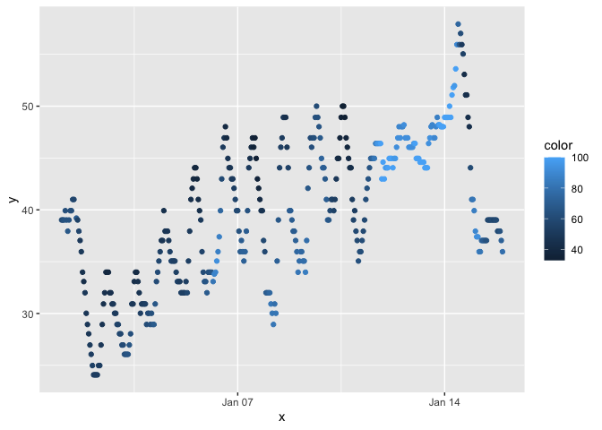

p8105_hw1_xz3173
================
Xue Zhang
2023-09-19

# Problem 1

Load the moderndive library.

``` r
library(moderndive)
```

Load the early_january_weather dataset.

``` r
data("early_january_weather")
```

Write a short description of the dataset using inline R code; accessing
the dataset help file can be informative.

This is a short description `early_january_weather` dataset. The summary
of the dataset is `skimr::skim(early_january_weather)` here.This dataset
has 15 variables, including `names(early_january_weather)`. The time of
the recording of this dataset is on January, 2023
`early_january_weather %>% select(month)`,
`early_january_weather %>% select(year)`. The duration of the dataset is
15 days `range(early_january_weather[["day"]])`. Everyday, the dataset
is recording for 23 hours `range(early_january_weather[["hour"]])`. The
range of the humidity is `range(early_january_weather[["humid"]])`. The
mean of the humidity is `mean(early_january_weather[["humid"]])`. The
range of the temperature is `range(early_january_weather[["temp"]])`.
The mean of the temperature is `mean(early_january_weather[["temp"]])`.

Make a scatterlot.

``` r
plot_df = tibble(
  x = early_january_weather[["time_hour"]],
  y = early_january_weather[["temp"]],
  color = early_january_weather[["humid"]]
)

ggplot(plot_df, aes(x = x, y = y, color = color)) + geom_point()
```

<!-- -->

Describe patterns that are apparent in this plot.

**The temperature has been growing from January 1st to January 14th,
which is below 50.Then, it is rapidly dropping down from January 14th to
January 15th. The humidity has been change low-high-low between January
1st to 10th, which the color is often dark blue.The humidity has keep
higher than 100 between January 11th and January 12th, which the color
is light blue.**

Export scatterplot.

``` r
ggsave("scatter_plot.pdf")
```

    ## Saving 7 x 5 in image

# Problem 2

Create a data frame.

``` r
set.seed(1234)
my_dataset = tibble(
  random_sample = rnorm(10),
  vec_logical = c(random_sample > 0),
  vec_char = c("A", "B", "C", "D", "E", "F", "G", "H", "I", "J"),
  vec_factor = factor(rep(c("Level 1", "Level 2", "Level 3"), length.out = 10))
)

my_dataset
```

    ## # A tibble: 10 × 4
    ##    random_sample vec_logical vec_char vec_factor
    ##            <dbl> <lgl>       <chr>    <fct>     
    ##  1        -1.21  FALSE       A        Level 1   
    ##  2         0.277 TRUE        B        Level 2   
    ##  3         1.08  TRUE        C        Level 3   
    ##  4        -2.35  FALSE       D        Level 1   
    ##  5         0.429 TRUE        E        Level 2   
    ##  6         0.506 TRUE        F        Level 3   
    ##  7        -0.575 FALSE       G        Level 1   
    ##  8        -0.547 FALSE       H        Level 2   
    ##  9        -0.564 FALSE       I        Level 3   
    ## 10        -0.890 FALSE       J        Level 1

Use pull to calculate mean.

``` r
my_dataset %>%
  pull(random_sample)
```

    ##  [1] -1.2070657  0.2774292  1.0844412 -2.3456977  0.4291247  0.5060559
    ##  [7] -0.5747400 -0.5466319 -0.5644520 -0.8900378

``` r
mean(my_dataset[["random_sample"]])
```

    ## [1] -0.3831574

``` r
my_dataset %>%
  pull(vec_logical)
```

    ##  [1] FALSE  TRUE  TRUE FALSE  TRUE  TRUE FALSE FALSE FALSE FALSE

``` r
mean(my_dataset[["vec_logical"]])
```

    ## [1] 0.4

``` r
my_dataset %>%
  pull(vec_char)
```

    ##  [1] "A" "B" "C" "D" "E" "F" "G" "H" "I" "J"

``` r
mean(my_dataset[["vec_char"]])
```

    ## Warning in mean.default(my_dataset[["vec_char"]]): argument is not numeric or
    ## logical: returning NA

    ## [1] NA

``` r
my_dataset %>%
  pull(vec_factor)
```

    ##  [1] Level 1 Level 2 Level 3 Level 1 Level 2 Level 3 Level 1 Level 2 Level 3
    ## [10] Level 1
    ## Levels: Level 1 Level 2 Level 3

``` r
mean(my_dataset[["vec_factor"]])
```

    ## Warning in mean.default(my_dataset[["vec_factor"]]): argument is not numeric or
    ## logical: returning NA

    ## [1] NA

**” Mean” works on Random_sample and vec_logical, do not work on
vec_char and vec_factor. “Mean” use for numeric variables. Random_sample
is classified as numeric. Vec_logical is classified as logical vector,
which contains True/False values, as arithmetic.**

Write code chunk with as.numeric function.

``` r
mean(as.numeric(my_dataset[["random_sample"]]))
mean(as.numeric(my_dataset[["vec_logical"]]))
mean(as.numeric(my_dataset[["vec_char"]]))
mean(as.numeric(my_dataset[["vec_factor"]]))
```

**Numeric variables can calculate “mean”. Logical variables, can be
convert to numeric (0 or 1, True or False), and calculate “mean”.
Character variables such as “A”,“B”, can not be converted to numeric
values. Therefore, the results of mean comes back with NA values and
warning message. Factor variables is a factor column with numeric
levels, so the output comes back with values, which is not meaningful.**
