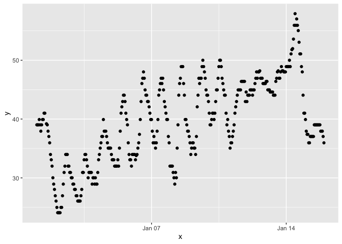

p8105_hw1_xz3173
================
Xue Zhang
2023-09-19

# Problem 1

Load the moderndive library.

``` r
library(moderndive)
```

Load the early_january_weather dataset.

``` r
data("early_january_weather")
```

Write a short description of the dataset using inline R code; accessing
the dataset help file can be informative.

- the variables in this dataset, including names/values of important
  variables

`This dataset has 15 variables. This dataset is conducted from January 1, 2013 to January 15, 2013.`

``` r
names(early_january_weather)
```

    ##  [1] "origin"     "year"       "month"      "day"        "hour"      
    ##  [6] "temp"       "dewp"       "humid"      "wind_dir"   "wind_speed"
    ## [11] "wind_gust"  "precip"     "pressure"   "visib"      "time_hour"

``` r
early_january_weather
```

    ## # A tibble: 358 × 15
    ##    origin  year month   day  hour  temp  dewp humid wind_dir wind_speed
    ##    <chr>  <int> <int> <int> <int> <dbl> <dbl> <dbl>    <dbl>      <dbl>
    ##  1 EWR     2013     1     1     1  39.0  26.1  59.4      270      10.4 
    ##  2 EWR     2013     1     1     2  39.0  27.0  61.6      250       8.06
    ##  3 EWR     2013     1     1     3  39.0  28.0  64.4      240      11.5 
    ##  4 EWR     2013     1     1     4  39.9  28.0  62.2      250      12.7 
    ##  5 EWR     2013     1     1     5  39.0  28.0  64.4      260      12.7 
    ##  6 EWR     2013     1     1     6  37.9  28.0  67.2      240      11.5 
    ##  7 EWR     2013     1     1     7  39.0  28.0  64.4      240      15.0 
    ##  8 EWR     2013     1     1     8  39.9  28.0  62.2      250      10.4 
    ##  9 EWR     2013     1     1     9  39.9  28.0  62.2      260      15.0 
    ## 10 EWR     2013     1     1    10  41    28.0  59.6      260      13.8 
    ## # ℹ 348 more rows
    ## # ℹ 5 more variables: wind_gust <dbl>, precip <dbl>, pressure <dbl>,
    ## #   visib <dbl>, time_hour <dttm>

``` r
head(early_january_weather)
```

    ## # A tibble: 6 × 15
    ##   origin  year month   day  hour  temp  dewp humid wind_dir wind_speed wind_gust
    ##   <chr>  <int> <int> <int> <int> <dbl> <dbl> <dbl>    <dbl>      <dbl>     <dbl>
    ## 1 EWR     2013     1     1     1  39.0  26.1  59.4      270      10.4         NA
    ## 2 EWR     2013     1     1     2  39.0  27.0  61.6      250       8.06        NA
    ## 3 EWR     2013     1     1     3  39.0  28.0  64.4      240      11.5         NA
    ## 4 EWR     2013     1     1     4  39.9  28.0  62.2      250      12.7         NA
    ## 5 EWR     2013     1     1     5  39.0  28.0  64.4      260      12.7         NA
    ## 6 EWR     2013     1     1     6  37.9  28.0  67.2      240      11.5         NA
    ## # ℹ 4 more variables: precip <dbl>, pressure <dbl>, visib <dbl>,
    ## #   time_hour <dttm>

``` r
tail(early_january_weather)
```

    ## # A tibble: 6 × 15
    ##   origin  year month   day  hour  temp  dewp humid wind_dir wind_speed wind_gust
    ##   <chr>  <int> <int> <int> <int> <dbl> <dbl> <dbl>    <dbl>      <dbl>     <dbl>
    ## 1 EWR     2013     1    15    18  39.0  26.1  59.4      360       5.75        NA
    ## 2 EWR     2013     1    15    19  37.9  26.1  61.9       10       4.60        NA
    ## 3 EWR     2013     1    15    20  37.9  25.0  59.2       20       6.90        NA
    ## 4 EWR     2013     1    15    21  37.9  27.0  64.3       30       5.75        NA
    ## 5 EWR     2013     1    15    22  37.0  28.9  72.2       20       8.06        NA
    ## 6 EWR     2013     1    15    23  36.0  30.0  78.8       20       9.21        NA
    ## # ℹ 4 more variables: precip <dbl>, pressure <dbl>, visib <dbl>,
    ## #   time_hour <dttm>

``` r
skimr::skim(early_january_weather)
```

|                                                  |                       |
|:-------------------------------------------------|:----------------------|
| Name                                             | early_january_weather |
| Number of rows                                   | 358                   |
| Number of columns                                | 15                    |
| \_\_\_\_\_\_\_\_\_\_\_\_\_\_\_\_\_\_\_\_\_\_\_   |                       |
| Column type frequency:                           |                       |
| character                                        | 1                     |
| numeric                                          | 13                    |
| POSIXct                                          | 1                     |
| \_\_\_\_\_\_\_\_\_\_\_\_\_\_\_\_\_\_\_\_\_\_\_\_ |                       |
| Group variables                                  | None                  |

Data summary

**Variable type: character**

| skim_variable | n_missing | complete_rate | min | max | empty | n_unique | whitespace |
|:--------------|----------:|--------------:|----:|----:|------:|---------:|-----------:|
| origin        |         0 |             1 |   3 |   3 |     0 |        1 |          0 |

**Variable type: numeric**

| skim_variable | n_missing | complete_rate |    mean |     sd |      p0 |     p25 |     p50 |     p75 |    p100 | hist  |
|:--------------|----------:|--------------:|--------:|-------:|--------:|--------:|--------:|--------:|--------:|:------|
| year          |         0 |          1.00 | 2013.00 |   0.00 | 2013.00 | 2013.00 | 2013.00 | 2013.00 | 2013.00 | ▁▁▇▁▁ |
| month         |         0 |          1.00 |    1.00 |   0.00 |    1.00 |    1.00 |    1.00 |    1.00 |    1.00 | ▁▁▇▁▁ |
| day           |         0 |          1.00 |    8.04 |   4.31 |    1.00 |    4.00 |    8.00 |   12.00 |   15.00 | ▇▇▇▇▇ |
| hour          |         0 |          1.00 |   11.53 |   6.92 |    0.00 |    6.00 |   11.50 |   17.75 |   23.00 | ▇▇▆▇▇ |
| temp          |         0 |          1.00 |   39.58 |   7.06 |   24.08 |   33.98 |   39.02 |   44.96 |   57.92 | ▃▇▇▇▁ |
| dewp          |         0 |          1.00 |   28.06 |  10.73 |    8.96 |   19.94 |   26.06 |   35.06 |   53.06 | ▃▇▆▂▃ |
| humid         |         0 |          1.00 |   65.48 |  18.95 |   32.86 |   51.34 |   61.67 |   78.68 |  100.00 | ▃▇▆▂▅ |
| wind_dir      |         5 |          0.99 |  208.19 | 115.58 |    0.00 |  140.00 |  240.00 |  290.00 |  360.00 | ▅▁▂▇▆ |
| wind_speed    |         0 |          1.00 |    8.23 |   4.61 |    0.00 |    5.75 |    8.06 |   11.51 |   24.17 | ▅▇▆▂▁ |
| wind_gust     |       308 |          0.14 |   22.53 |   3.63 |   16.11 |   19.56 |   21.86 |   25.32 |   31.07 | ▅▇▃▇▁ |
| precip        |         0 |          1.00 |    0.00 |   0.01 |    0.00 |    0.00 |    0.00 |    0.00 |    0.19 | ▇▁▁▁▁ |
| pressure      |        38 |          0.89 | 1022.52 |   5.57 | 1010.80 | 1018.30 | 1022.05 | 1027.23 | 1034.40 | ▃▇▇▇▃ |
| visib         |         0 |          1.00 |    8.52 |   3.00 |    0.12 |    9.00 |   10.00 |   10.00 |   10.00 | ▁▁▁▁▇ |

**Variable type: POSIXct**

| skim_variable | n_missing | complete_rate | min                 | max                 | median              | n_unique |
|:--------------|----------:|--------------:|:--------------------|:--------------------|:--------------------|---------:|
| time_hour     |         0 |             1 | 2013-01-01 01:00:00 | 2013-01-15 23:00:00 | 2013-01-08 12:30:00 |      358 |

- the size of the dataset nrow = number of rows in the dataset ncol =
  number of columns in the dataset

``` r
nrow(early_january_weather)
```

    ## [1] 358

``` r
ncol(early_january_weather)
```

    ## [1] 15

- the mean temperature

``` r
mean_temp = early_january_weather$temp
mean(mean_temp)
```

    ## [1] 39.58212

Make a scatterlot of temp (y) vs time_hour (x); color points using the
humid variable (adding color = …) inside of aes in your ggplot code
should help). Describe patterns that are apparent in this plot.

``` r
plot_df = tibble(
  x = early_january_weather$time_hour,
  y = early_january_weather$temp,
  color = early_january_weather$humid
)

ggplot(plot_df, aes(x = x, y = y, color = color)) + geom_point()
```

<!-- -->

Export your scatterplot to your project directory using ggsave.

``` r
ggsave("scatter_plot.pdf")
```

    ## Saving 7 x 5 in image

# Problem 2

Create a data frame comprised of:

- a random sample of size 10 from a standard Normal distribution
- a logical vector indicating whether elements of the sample are greater
  than 0
- a character vector of length 10
- a factor vector of length 10, with 3 different factor “levels”

``` r
set.seed(1234)
data_frame = tibble(
  random_sample = rnorm(10),
  vec_logical = c(random_sample > 0),
  vec_char = c("A", "B", "C", "D", "E", "F", "G", "H", "I", "J"),
  vec_factor = factor(rep(c("Level 1", "Level 2", "Level 3"), length.out = 10))
)

data_frame
```

    ## # A tibble: 10 × 4
    ##    random_sample vec_logical vec_char vec_factor
    ##            <dbl> <lgl>       <chr>    <fct>     
    ##  1        -1.21  FALSE       A        Level 1   
    ##  2         0.277 TRUE        B        Level 2   
    ##  3         1.08  TRUE        C        Level 3   
    ##  4        -2.35  FALSE       D        Level 1   
    ##  5         0.429 TRUE        E        Level 2   
    ##  6         0.506 TRUE        F        Level 3   
    ##  7        -0.575 FALSE       G        Level 1   
    ##  8        -0.547 FALSE       H        Level 2   
    ##  9        -0.564 FALSE       I        Level 3   
    ## 10        -0.890 FALSE       J        Level 1

Try to take the mean of each variable in your dataframe. What works and
what doesn’t?

``` r
mean(data_frame$random_sample)
```

    ## [1] -0.3831574

``` r
mean(data_frame$vec_logical)
```

    ## [1] 0.4

``` r
mean(data_frame$vec_char)
```

    ## Warning in mean.default(data_frame$vec_char): argument is not numeric or
    ## logical: returning NA

    ## [1] NA

``` r
mean(data_frame$vec_factor)
```

    ## Warning in mean.default(data_frame$vec_factor): argument is not numeric or
    ## logical: returning NA

    ## [1] NA

” Mean” works on Random_sample and vec_logical, do not work on vec_char
and vec_factor.

“Mean” use for numeric variables.

Random_sample is classified as numeric. Vec_logical is classified as
logical vector, which contains True/Falswe values, as arithmetic.

Hint: for now, to take the mean of a variable in a dataframe, you need
to pull the variable out of the dataframe. Try loading the tidyverse and
using the pull function.

``` r
library(tidyverse)
```

``` r
data_frame %>%
  mean(pull(random_sample))
```

    ## Warning in mean.default(., pull(random_sample)): argument is not numeric or
    ## logical: returning NA

    ## [1] NA

``` r
data_frame %>%
  mean(pull(vec_logical))
```

    ## Warning in mean.default(., pull(vec_logical)): argument is not numeric or
    ## logical: returning NA

    ## [1] NA

``` r
data_frame %>%
  mean(pull(vec_char)) 
```

    ## Warning in mean.default(., pull(vec_char)): argument is not numeric or logical:
    ## returning NA

    ## [1] NA

``` r
data_frame %>%
  mean(pull(vec_factor))
```

    ## Warning in mean.default(., pull(vec_factor)): argument is not numeric or
    ## logical: returning NA

    ## [1] NA

“Pull” can not apply on random_sample. “Pull” use for charactere or
factor variables.

In some cases, you can explicitly convert variables from one type to
another. Write a code chunk that applies the as.numeric function to the
logical, character, and factor variables (please show this chunk but not
the output). What happens, and why? Does this help explain what happens
when you try to take the mean?

``` r
mean(as.numeric(data_frame$random_sample))
mean(as.numeric(data_frame$vec_logical))
mean(as.numeric(data_frame$vec_char))
mean(as.numeric(data_frame$vec_factor))
```

Outputs come back with NA values, which is not meaningful.

- Numeric variables can calculate “mean”.
- Logical variables, can be convert to numeric (0 or 1, True or False),
  and caluculate “mean”.
- Character variables and factor variables are not meaningful, when
  calculate “mean”.
